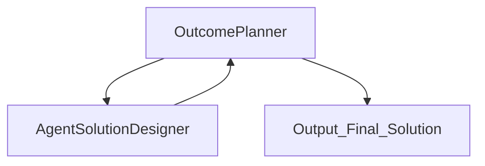
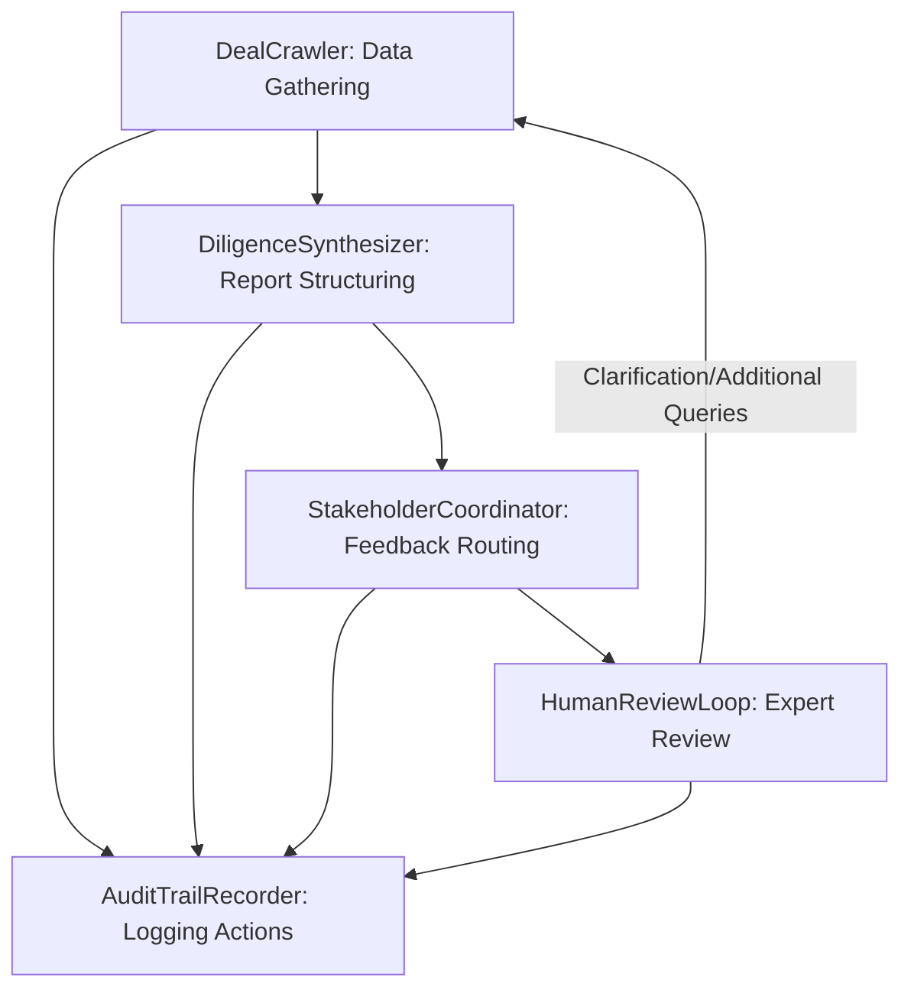

# AI FOUNDRY WORKSHOP (Prototype)

## To create this Multi-Agent Prototype you will need AI Foundry, follow these steps

1) Build the Outcome Plannner Agent [OutCome Planner Agent](./outcome_planner_One_foundry.md)
2) Build the **Agent Solution Designer** agent [Agent Solutions Designer Agent](./Agent_solution_Designer.md)
3) Add the **Agent Solution Designer** agent as a **Connected Agent** to the **Outcome Planner Agent**
4) Test the two agent system with the prompts below


## Solution Workflow Diagram


## Demo the exisiting System
### Audience Follow Along or create and extend the agent


## Use the Outcome Planner Agent #2 to design a system

### Prompt #1

#### Enter the Following into OutCome Planner
```text
Department : Investment Bank Research Department  
Goal: Use AI Agents to accelerate research and due diligence of a company before we fund or aquire the company we need to look at the founders, current investors,  addressable market, we need to include our internal stakeholders like legal , compliance, technology etc
```

### Prompt #2
``` Text
You are an expert at generating Instructions for an AI Agent. Consider the 1st agent and the types or data sets and actions it would need to access. Generate an Instructions that Give the  agent clear directions on what to do and how to do it. Include specific tasks, their order, and any special instructions like tone or engagement style.

```

## Next Steps

### Adding the Agent Instructions Generator

6) Build the **Agent Instructions Agent** agent as and add as a **Connected Agent** To the **OutCome Planner Agent**


## Output

# Department  
Investment Bank Research Department  
   
# Goal   
Use AI Agents to accelerate research and due diligence of a company before funding or acquisition, including analysis of founders, current investors, addressable market, and integration of internal stakeholders (legal, compliance, technology, etc).  
   
# Business_context  
The Investment Bank Research Department typically handles a high volume of potential deals under tight deadlines, where comprehensive diligence is mission-critical. Due diligence often involves manual data collection on company background, founders’ history, investor profiles, and market size from disparate sources. Internal coordination with legal, compliance, and technology departments can be slow and inconsistent, with feedback arriving in silos. Audit trails for regulatory and risk management are essential and often require additional overhead. Staff are pressured to accelerate deal cycles and avoid overlooking risks while supporting enterprise-scale decision-making and documentation standards.  
   
# Strategic Intent  
Streamline and standardize due diligence processes, reduce deal cycle times, ensure completeness and repeatability of research, and foster robust, cross-functional collaboration. Minimize risk through thorough, consistent review while maintaining a transparent, auditable process for all stakeholder contributions.  
   
# AI Opportunity Hypothesis  
AI Agents offer an opportunity to automate the most time-consuming and error-prone aspects of the diligence process. Agents can rapidly assemble and synthesize company data, analyze founders and investors, and estimate addressable markets using both internal sources and public data. They can generate standardized reports and flag data gaps/risks, ensuring all critical diligence areas are consistently covered. AI-driven coordination platforms can route dossiers to legal, compliance, and tech teams, track comments, and aggregate feedback in near real-time, breaking down organizational silos. Human-in-the-loop review is streamlined with clear escalation paths for expert analysis or extra diligence steps. An audit agent documents every action for regulatory compliance and process QA. Measuring performance and collecting stakeholder feedback would guide incremental improvements, while ongoing change management would involve training staff on new workflows, regularly reviewing agent decision logic, and updating them to reflect evolving regulatory and investment priorities. Adoption could be further supported by integrating agent outputs into existing research/CRM systems and by upskilling current analysts to focus on high-value expert review rather than manual data tasks, increasing job satisfaction and retention. Operational efficiency can be tracked via deal cycle time, completeness of reports, and stakeholder satisfaction scores.  
   
## From the Agent Solution Designer  
   
# Proposed agent list and description  
   
- **DealCrawler**: Automates data gathering for target companies, founders, investors, and market data from external and internal sources.  
- **DiligenceSynthesizer**: Standardizes and structures raw data into a dossier highlighting key risks, opportunities, and gaps.  
- **StakeholderCoordinator**: Routes dossiers to internal teams (Legal, Compliance, Technology), tracks feedback status, and aggregates comments into a shared workspace.  
- **AuditTrailRecorder**: Captures all agent and human interactions and feedback into an immutable audit log for compliance and reporting.  
- **HumanReviewLoop**: Surfaces findings to analysts, directors, and human reviewers, captures structured feedback, and routes clarifications back to agents as needed for deeper investigation or re-processing.  
   
# Agent orchestration plan:   

   
# Agent Orchestration description  

The diligence workflow begins with the **DealCrawler**, which automates the collection of relevant data (company, founders, investors, and market) from multiple sources. The data is passed to the **DiligenceSynthesizer**, which organizes and structures these findings, tagging salient risks, opportunities, and gaps in a standardized dossier format. The **StakeholderCoordinator** then distributes the dossiers to appropriate internal teams (Legal, Compliance, Technology) and tracks their status and comments, aggregating feedback for a collaborative review. Next, the **HumanReviewLoop** presents synthesized findings and feedback to designated human reviewers, enabling them to provide deep insights, request clarifications, or initiate secondary queries, which are then routed back to prior agents if further investigation is warranted. Throughout the process, the **AuditTrailRecorder** captures all agent activities and human interventions into an immutable audit log, supporting regulatory compliance and internal transparency. This orchestration streamlines due diligence, ensures consistency, accelerates decision-making, and reduces risk exposure by embedding both automation and expert judgment throughout the process, while providing a robust, auditable trail for every decision and interaction.
-----------
# Demo
# STOP HERE 


