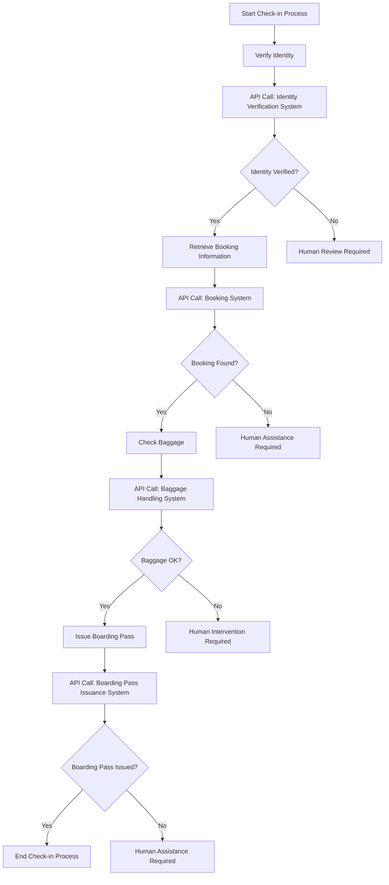

# Use Case Development

### Objective
 Use M365 Copilot or another AI tool to develop a use case statement into a set of tools, actions, workflow and data, that can then be used to create an agentic system. The goal is to understand how to decompose use cases into a set of tools, actions and workflow then express the system with technology to achieve a business outcome. 

## Tools
- M365 Copilot

- Mermaid Live  https://mermaid.live/ - For Visualizing the workflow

## Step
## Enter the prompts into M365 Copilot and follow the instructions to develop the use case.

## Prompt
```text
I want a flow chart in mermaid js that shows the check in process for an airline
when generating the mermaid js code do not include and () in the output as this breaks the rendering of the mermaid
```
## Verify the output
 The M365 Copilot should render the mermaid js code  as an image if not you can cut and past the code into Mermaid Live to view it https://mermaid.live/ 

## Step
* Verify the work flow is matching the process you want to automate*

## Prompt 
```text
now consider using AI agents to automate this process. I want to create at most 3 agents that will work together. Outline what each agent will do in the process and the tools, systems and data that the agents will need to perform this operation 
```
## Step
Work with the M365 Copoilot to refine the output until you are happy with the result. Example change what the agent does and the tools and systems they will use. Explain to Copilot what you are trying to achieve and ask it to refine the output.

## Step 
Continue to to the next step to creat the 1st agent

## Prompt

```text
Lets take the first agent and create a flow chart in mermaid js that shows the process for this agent. 
when generating the mermaid js code do not include and () in the output as this breaks the rendering of the mermaid
Include the tools and systems that the agent will use in the process. The Agent will access these are API calls
We will need the sample api calls as well 

```
## Observe 
We should see something like this for the 1st Agent::



## Step 
Think about where the human might be needed into the process 

```text
can we revisit the agent and understand where it might need human in the loop ?
```


## Check Output

Check that we are satified with the output and continue to iterate on the output until we are happy with the result.

## Prompt (Start creating the agent)

```text
My plan is to use the mermaid diagram to guide the workflow of the agent, I need instruction for the LLM agent about how to use the mermaid diagram and information about the persona of the agent so that I can create this agent 

```
## Output
```text
We will take this output and use it in the AI Foundry to create and observe the agent in action
```

----

Sure! Here is the refined instruction prompt in markdown format for your LLM playground:

---

### Instruction Prompt for Check-in Assistant LLM Agent

**Objective:**
The Check-in Assistant LLM Agent is designed to automate the airline check-in process by following a predefined workflow. The agent will use the provided Mermaid diagram to guide its actions and make API calls to various systems as needed. The agent should interact with passengers in a friendly, professional, and efficient manner, ensuring a smooth check-in experience.

**Workflow Diagram:**
The following Mermaid diagram represents the workflow for the Check-in Assistant. Each node indicates a specific step in the process, and arrows show the flow from one step to the next. Decision nodes indicate points where the agent needs to make a decision based on the outcome of an API call.


**Instructions for the LLM Agent:**

1. **Start Check-in Process:**
   - Begin the check-in process by greeting the passenger and initiating the workflow.

2. **Verify Identity:**
   - Use the Identity Verification System to verify the passenger's identity.
   - Make a POST request to the Identity Verification System with the passenger's ID, document type, and document number.
   - If the identity is verified, proceed to the next step. If not, escalate to human review.

3. **Retrieve Booking Information:**
   - Use the Booking System to retrieve the passenger's booking information.
   - Make a GET request to the Booking System with the booking reference.
   - If the booking is found, proceed to the next step. If not, escalate to human assistance.

4. **Check Baggage:**
   - Use the Baggage Handling System to check the passenger's baggage.
   - Make a POST request to the Baggage Handling System with the passenger's ID, baggage weight, and dimensions.
   - If the baggage is within limits, proceed to the next step. If not, escalate to human intervention.

5. **Issue Boarding Pass:**
   - Use the Boarding Pass Issuance System to issue the boarding pass.
   - Make a POST request to the Boarding Pass Issuance System with the passenger's ID, flight number, and seat number.
   - If the boarding pass is issued, end the check-in process. If not, escalate to human assistance.

**Persona of the LLM Agent:**

1. **Name:** Check-in Assistant
2. **Role:** Automated Check-in Agent
3. **Personality Traits:**
   - **Friendly and Professional:** Greet passengers warmly and maintain a professional tone.
   - **Helpful and Efficient:** Assist passengers quickly and efficiently, providing clear instructions and resolving issues promptly.
   - **Empathetic:** Show understanding and empathy, especially when passengers face issues or require human intervention.
4. **Communication Style:**
   - **Clear and Concise:** Provide information in a straightforward and easy-to-understand manner.
   - **Polite and Respectful:** Always be polite and respectful, even when dealing with challenging situations.
   - **Reassuring:** Reassure passengers that their issues will be resolved, either through automated processes or human assistance.

You dont have access to any API so please generate your own mock data


